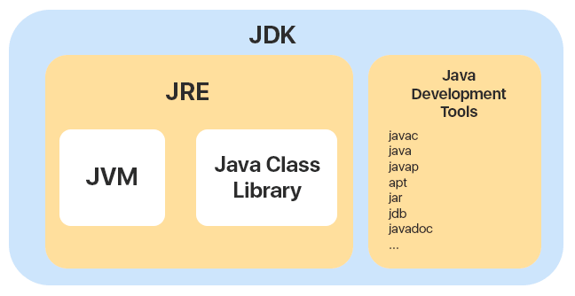

## JDK JRE JVM 구성 원리

세 용어의 관계를 정리해보자



### 자바 개발 키트(JDK, Java Development Kit)
- 자바를 사용하기 위해 필요한 모든 기능을 갖춘 자바용 **SDK(Software Development Kit)**
- 우리가 일반적으로 자바를 공부하기위해 설치하는게 바로 JDK이다.
- JDK를 설치하면 JRE, JVM이 함께 설치된다.
- JDK에는 JRE에 없는 자바 컴파일러(javac)와 jdb, javadoc 과 같은 도구를 포함한다.
- 자바로 만들어진 프로그램을 실행만 할 경우 JRE만 설치해도 되지만, 자바로 뭔가 만들어보고 싶은 개발자는 JDK를 설치해야한다.

**SDK란?**
```
소프트웨어 개발 키트(Software Development Kit)
하드웨어 플랫폼, 운영체제 또는 프로그래밍 언어 제작사가 제공하는 툴이다.
키트의 요소는 제작사마다 다르다.
SDK의 대표적인예로 JDK 등이 있다.
SDK를 활용하여 애플리케이션을 개발할 수 있다.
```

<br>

### 자바 런타임 환경(JRE, Java Runtime Environment)
- JVM + 자바 클래스 라이브러리(Java Class Library) 등으로 구성되어 있다.
- **위 그림에는 나오지 않지만 자바 클래스 로더(Java Class Loader) 또한 JRE의 구성요소이다.**
- 컴파일 된 Java 프로그램을 **실행**하는데 필요한 패키지
- 클래스 로더, 클래스 라이브러리를 통해 **작성한 자바코드를 라이브러리와 결합한 후** JVM에 넘겨 실행시킨다.
- JRE는 그 자체로 특별한 기능을 한다기보다는 JVM이 원활하게 작동할 수 있도록 환경을 맞춰주는 역할을 한다.

<br>

### 자바 가상 머신(JVM, Java Virtual Machine)
- 자바 프로그램이 어느 기기, 어느 운영체제 상에서도 실행될 수 있게 만들어 준다.
- 자바 프로그램의 메모리를 효율적으로 관리 & 최적화 시켜준다.

**가비지 컬랙션(GC, Garbage Collection)**
```
JVM이 메모리를 관리하는 프로세스를 지칭하는 용어이다.
자바 프로그램 상에서 사용하지 않는 메모리를 지속적으로 찾아 제거함으로써 효율적인 메모리 관리를 가능하게 함
```

JVM의 자세한 정보를 별도의 게시물로 포스팅했다. 참고한다면 이해가 쉬울 것이다.  
[[Java] JVM의 목적]([Java]%20JVM의%20목적.md)

---

### Reference

[[JAVA] JVM이란? 개념 및 구조 (JDK, JRE, JIT, 가비지 콜렉터...)](https://doozi0316.tistory.com/entry/1%EC%A3%BC%EC%B0%A8-JVM%EC%9D%80-%EB%AC%B4%EC%97%87%EC%9D%B4%EB%A9%B0-%EC%9E%90%EB%B0%94-%EC%BD%94%EB%93%9C%EB%8A%94-%EC%96%B4%EB%96%BB%EA%B2%8C-%EC%8B%A4%ED%96%89%ED%95%98%EB%8A%94-%EA%B2%83%EC%9D%B8%EA%B0%80)  
[[Java] JDK? JRE? JVM?](https://m.blog.naver.com/goreng2/221770110714)  
