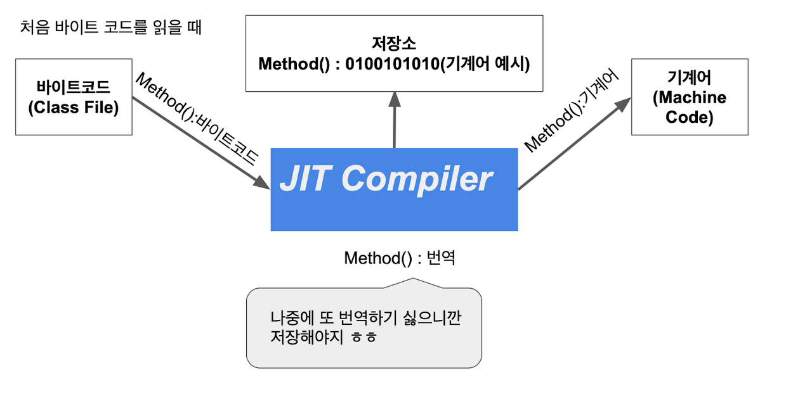
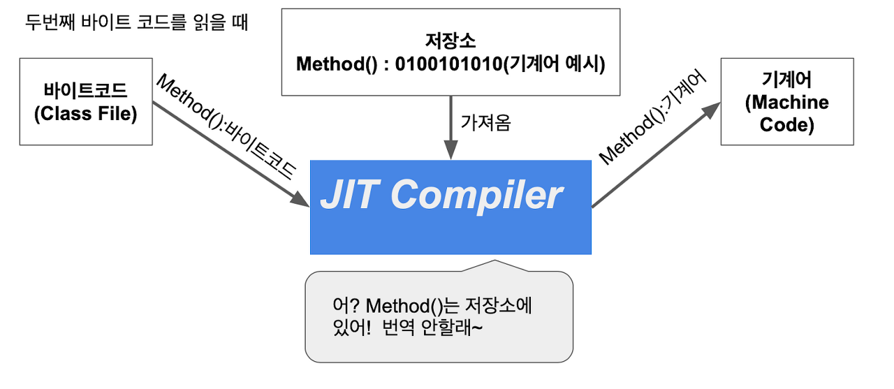

```
본문에 앞서 컴파일러와 인터프리터의 개념이 명확하지 않다면 아래의 포스팅을 읽고 오는것을 추천한다.
이해가 훨신 쉬워질 것이다.
```
[[Java] 컴파일러 vs 인터프리터]([Java]%20컴파일러%20vs%20인터프리터.md)

## JIT 컴파일러(Just In Time Compiler)

원래 자바의 JVM에서는 인터프리터 방식만 사용했다. 하지만 성능 문제가 발생했고 JIT 컴파일러를 추가해서 성능을 올리게 되었다.

<br>

### JIT 컴파일러 동작 방식
JIT 컴파일러는 실행 시점에는 인터프리터와 같이 기계어 코드를 생성하면서 해당 코드가 임계치를 넘어 컴파일 대상이 되면 컴파일 하고 그 코드를 캐싱한다. JIT 컴파일은 코드가 실행되는 과정에 실시간으로 일어나며 그래서 **Just-In-Time** 이다. 전체 코드의 필요한 부분만 변환한다. 기계어로 변환된 코드는 캐시에 저장되기 때문에 같은 내용은 다시 컴파일 할 필요가 없다.`(반복문을 생각하면 좋을것이다.)`

- JIT 컴파일러의 컴파일 조건은 코드의 실행 빈도가 임계치에 도달했는가 이다.
- 임계치는 메서드가 호출된 횟수, 메서드의 루프를 빠져나오기까지 횟수 두 개를 기반으로 한다. 두 수의 합계를 확인하고 메서드가 컴파일될 자격이 있는지 여부를 결정한다.
- 자격이 있다면 메서드는 컴파일되기 위해 큐에서 대기한다. 이후 컴파일 스레드에 의해 컴파일 된다.
- 오랫동안 돌아가는 반복문이 있다고 가정해보자, 반복문의 카운터가 임계치를 넘어가면 해당 반복문은 컴파일 대상이 된다. JVM은 반복문의 코드를 컴파일된 코드로 교체하고 더 빠르게 실행한다. 이러한 교체 과정을 **"스택 상의 교체(On-Stack Replacement, ORS)"** 라고 부른다.




## JIT 컴파일러의 이점
일반적인 인터프리터 언어는 바이트 코드 또는 소스코드를 최적화 과정 없이 한줄 한줄 번역하기 때문에 성능이 낮다. 반면 정적으로 컴파일 하는 언어는 실행 전 반드시 컴파일을 해야 하기 때문에 모든 코드를 컴파일 하는 시간이 소요된다. JIT 컴파일러는 실행 과정에서 컴파일 할 수 있도록 만들어졌다. 정적 컴파일러의 장점과 인터프리터의 장점을 모두 가진 것이다.  

---

### Reference

[# [Java] JIT 컴파일러란?](https://hyeinisfree.tistory.com/26)  
