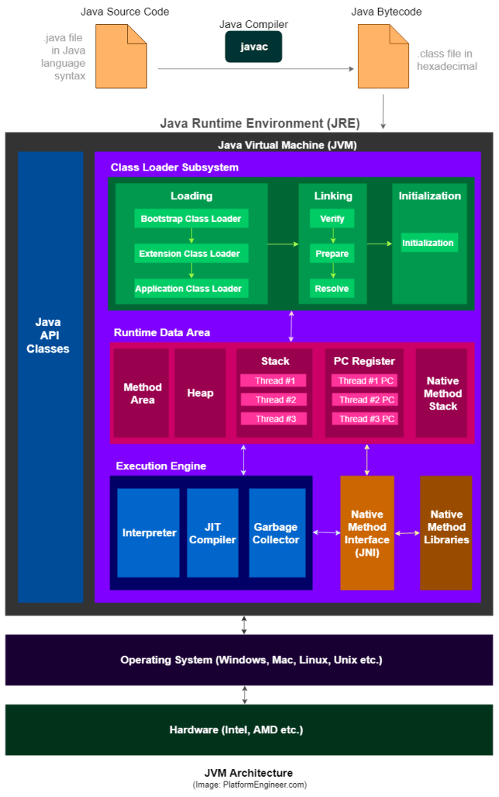

## 자바 가상 머신(Java Virtual Machine)

자바 프로그램 실행환경을 만들어주는 소프트웨어. 자바 코드를 컴파일 하여 .class 바이트 코드로 만들면 이 코드가 JVM 환경에서 실행된다. JVM은 자바 실행환경 JRE(Java Runtime Environment) 에 포함되어 있다. 현재 사용하는 컴퓨터의 운영체제에 맞는 자바 실행환경(JRE)가 설치되어 있다면 자바 가상 머신이 설치되어 있다는 뜻.


**이들은 모두 JDK 에 포함 되는데 자세한 정보는 아래 링크를 확인하자.**  
[[Java] JDK JRE JVM 구성 원리]([Java]%20JDK%20JRE%20JVM%20구성%20원리.md)

JVM의 목적은 크게 두 가지로 말할 수 있는데.
1. 자바 프로그램이 어느 기기나 운영체제 상에서도 실행될 수 있도록 하는 것
2. 프로그램 메모리를 관리하고 최적화 하는 것


C언어로 작성된 Test.c가 있다고 가정했을때, 윈도우 컴파일러를 사용해서 컴파일하면 Test.exe가 만들어진다. 윈도우 컴파일러로 컴파일되었기에 Test.exe는 윈도우에서만 실행되는 실행 파일. 리눅스 운영체제 에서는 실행할 수 없다. 즉 C / C++에서는 컴파일 플랫폼과 타겟 플랫폼이 다를 경우 프로그램이 동작하지 않는다. 만약 Test.exe 파일을 리눅스 운영체제에서 실행하려면 리눅스 환경을 타겟으로 크로스 컴파일 해서 리눅스 운영체제에 맞는 실행 파일을 새로 만들어야 한다는 것.

그러나 Java의 경우 Test.java를 컴파일 하면 Test.class 파일이 생성된다. 그리고 이렇게 생성된 바이트 코드를 각자의 플랫폼에 설치되어 있는 JVM이 운영체제에 맞는 실행 파일로 바꿔준다. 즉 Java에서는 하나의 바이트 코드로 JVM이 설치된 모든 플랫폼에서 동작이 가능하다는 이야기.

## JVM 동작 방식

```
1. 자바로 개발된 프로그램을 실행하면 JVM은 OS로 부터 메모리를 할당 받는다.  
2. 자바 컴파일러(Javac)가 자바 소스코드(.java)를 바이트코드(.class)로 컴파일 한다. 
3. 클래스 로더를 통해 JVM Runtime Data Area로 로딩한다.
4. Runtime Data Area로 로딩된 .class들은 Execution Engine을 통해 해석한다.
5. 해석된 바이트 코드는 Runtime Data Area의 각 영역에 배치되어 수행하며 이 과정에서 Execution Engine에 의해 GC의 작동과 스레드 동기화가 이루어진다.
```

## JVM 구조


### 클래스 로더(Class Loader)
- JVM 내로 클래스 파일(.class) 을 로드하고, 링크를 통해 배치하는 작업을 수행하는 모듈
- Runtime시 동적으로 클래스를 로드하고 jar 파일 내 저장된 클래스들을 JVM에 탑재
- 즉, 클래스를 처음으로 참조할 때, 해당 클래스를 로드하고 링크하는 역할을 함

### 실행 엔진(Execution Engine)
- 클래스를 실행시키는 역할
- 클래스 로더가 JVM내의 런타임 데이터 영역에 바이트 코드를 배치시키고, 실행 엔진에 의해 실행된다.
- 바이트 코드(.class) 는 비교적 인간이 보기 편한 형태로 기술된 것이다. 실행 엔진은 이와 같은 바이트 코드를 JVM 내부에서 실제로 기계가 실행할 수 있는 형태로 변환한다.

### ↳인터프리터
- 실행 엔진은 자바 바이트 코드를 명령어 단위로 읽어서 실행한다.
- 한 줄씩 수행하기 때문에 느리다는 단점이 있다.

### ↳JIT(Just-In-Time)
- 인터프리터 방식으로 실행하다가 적절한 시점에 바이트 코드 전체를 컴파일 하여 그 코드를 캐싱한다.
- 컴파일 하여 기계어로 변환된 코드는 캐시에 저장되기 때문에 재사용 시 컴파일을 다시 할 필요가 없다.  
[JIT 자세히 살펴보기]([Java]%20JIT%20란?.md)

### 가비지 콜렉터(GC)
- 더이상 사용되지 않는 인스턴스를 찾아 메모리에서 삭제함

### Runtime Data Area


프로그램을 수행하기 위해 OS에서 할당받은 메모리 공간

### ↳PC Register
- Thread가 생성될 때 함께 생성되는 영역으로 ***프로그램 카운터***, 즉 현재 스레드가 실행되는 부분의 주소와 명령을 저장하고 있음  
[[OS] 프로세스와 스레드]([OS]%20프로세스와%20스레드.md)

### ↳JVM 스택 영역
- 프로그램 실행과정에서 임시로 할당되었다가 메소드를 빠져나가면 바로 소멸되는 특성의 데이터를 저장하기 위한 영역
- 메소드 호출 시마다 각각의 스택 프레임(해당 메서드만을 위한 공간) 이 생성된다. 메서드 수행이 띁나면 프레임 별로 삭제한다.
- 메소드 안에서 사용되는 임시 데이터, 스레드나 메소드의 정보를 저장한다. 또 호출된 메서드의 매개변수, 지역변수, 리턴 값 및 연산시 일어나는 값들을 임시로 저장한다.

### ↳Native method stack
- Java가 아닌 다른 언어(C, C++, 어셈블리 등)로 저장된 코드를 위한 공간.
- 보통 C/C++ 등의 코드를 수행하기 위한 스택을 말하며 Java Native Interface를 통해 바이트 코드로 전환하여 저장하게 된다.
- 일반 프로그램처럼 커널이 스택을 잡아 독자적으로 프로그램을 실행시키는 영역

(업데이트 중)

---

### Reference

[[Java] 자바 가상머신 JVM(Java Virtual Machine) 총정리](https://coding-factory.tistory.com/827)  
[자바 가상 머신(Java Virtual Machine)](https://github.com/gyoogle/tech-interview-for-developer/blob/master/Language/%5Bjava%5D%20%EC%9E%90%EB%B0%94%20%EA%B0%80%EC%83%81%20%EB%A8%B8%EC%8B%A0(Java%20Virtual%20Machine).md#%EC%9E%90%EB%B0%94-%EA%B0%80%EC%83%81-%EB%A8%B8%EC%8B%A0java-virtual-machine)  
[# JDK / JRE / JVM 개념 & 구성 원리 💯 총정리](https://inpa.tistory.com/entry/JAVA-%E2%98%95-JDK-JRE-JVM-%EA%B0%9C%EB%85%90-%EA%B5%AC%EC%84%B1-%EC%9B%90%EB%A6%AC-%F0%9F%92%AF-%EC%99%84%EB%B2%BD-%EC%B4%9D%EC%A0%95%EB%A6%AC)  
[JVM 메모리 구조](https://github.com/devFancy/2023-CS-Study/blob/main/java/java_jvm_architecture.md)  
[[JAVA] JVM이란? 개념 및 구조 (JDK, JRE, JIT, 가비지 콜렉터...)](https://doozi0316.tistory.com/entry/1%EC%A3%BC%EC%B0%A8-JVM%EC%9D%80-%EB%AC%B4%EC%97%87%EC%9D%B4%EB%A9%B0-%EC%9E%90%EB%B0%94-%EC%BD%94%EB%93%9C%EB%8A%94-%EC%96%B4%EB%96%BB%EA%B2%8C-%EC%8B%A4%ED%96%89%ED%95%98%EB%8A%94-%EA%B2%83%EC%9D%B8%EA%B0%80)