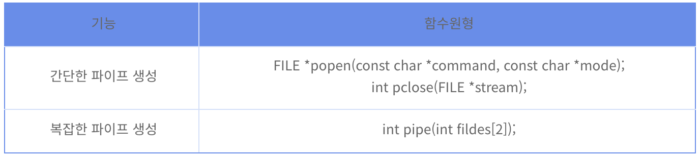
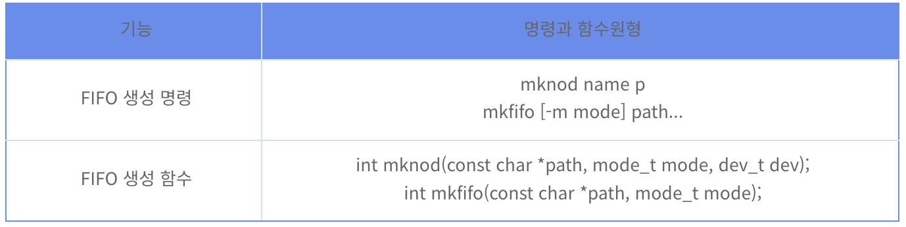

## IPC의 종류와 특징
**IPC(Inter Process Communication)**  
프로세스는 독립적으로 실행된다. 이런 독립적 구조를 가진 프로세스 간의 통신을 해야하는 상황이 있을 것이다. 이를 가능하도록 해주는 것이 IPC 통신이다.  
프로세스는 커널이 제공하는 IPC 설비를 이용해 프로세스간 통신을 할 수 있다.

**커널(Kernel)**: `운영체제의 핵심적인 부분, 다른 모든 부분에 시스템 내부적인 서비스를 제공해준다.`  
[OS. 커널 구조와 유형](OS.%20커널%20구조와%20유형.md)  

IPC 설비의 종류는 다양하고 필요에 따라 선택해서 사용해야 한다.

 

### IPC 종류

#### ↳익명 PIPE
- 파이프는 파일의 일종이다.
- 익명 파이프는 통신을 할 프로세스를 명확하게 알 수 있는 경우 사용한다.  
  `ex) 부모 자식 프로세스간 통신`
- 부모-자식 프로세스간의 통신을 가능하게 해준다. 부모 프로세스가 파이프를 생성하고 fork 함수를 통해 자식 프로세스를 생성하여 통신한다. 
- 하나의 프로세스는 데이터를 쓰기만 가능하고 다른 하나는 데이터를 읽기만 할 수 있다. 이러한 한쪽 방향으로만 통신이 가능한 파이프의 특징 때문에 **Half-Duplex(반이중) 통신** 이라고 부르기도 한다.
- 만약 읽기와 쓰기를 모두 하고싶다면 두개의 파이프를 생성해야한다.

**장점**
- 간단한 사용 - 한쪽 프로세스가 읽기만 하고 다른 쪽 프로세스는 쓰기만 하는 단순한 데이터 흐름을 가진다면 파이프를 간단하게 사용할 수 있다.

**단점**
- **같은 PPID(같은 부모 프로세스)** 를 가지는 프로세스들 사이에서만 통신이 가능하다.
- 전이중 통신의 복잡성 - 파이프를 이용해 **양방향 통신(전이중 통신)** 을 하려면 두개의 파이프를 생성하면 된다. 그러나 파일 기술자를 여닫는 과정이 다소 복잡하기에 전이중 통신을 고려한다면 파이프는 좋은 선택이 아닐듯하다.

#### ↳Named PIPE(FIFO)
- 전혀 모르는 사이의 통신에 사용한다.
- **부모 프로세스와 무관하게 전혀 다른 프로세스들 사이에서 통신이 가능하다.**
- 독립적인 프로세스들은 서로의 존재를 알 수 없기 때문에 파이프를 이용하려면 파이프명이 있어야 한다.
- 이름 있는 파이프는 특수 파일의 한 종류로 **FIFO(First-In First-Out)** 라고도 한다.
- 한 프로세스가 FIFO로 사용할 특수 파일을 생성하면, 이 파일의 이름을 알고 있는 다른 프로세스가 같은 FIFO를 이용해 통신을 수행한다. 

**장점**
- 부모 프로세스와 무관하게 전혀 다른 프로세스들 사이에서 통신이 가능하다.

**단점**
- 익명 파이프와 마찬가지로 단방향 통신이다.
- 양방향 통신을 위해서는 두개의 FIFO파일이 필요하다.

#### ↳Message Queue

#### ↳공유 메모리

#### ↳메모리 맵

#### ↳소켓

---

### Reference

[IPC(Inter Process Communication)](https://github.com/gyoogle/tech-interview-for-developer/blob/master/Computer%20Science/Operating%20System/IPC(Inter%20Process%20Communication).md)  
[IPC의 종류와 특징](https://jwprogramming.tistory.com/54)  
[[통신프로그래밍] 파이프](https://12bme.tistory.com/226)
