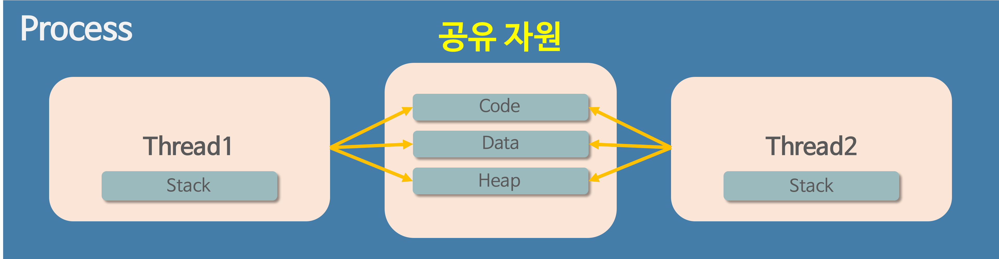

## 프로세스와 스레드(Process and Thread)

우선 선수 지식으로 프로그램의 개념을 알아보자.

**프로그램(Program)**
```
어떤 작업을 위해 실행할 수 있는 파일
컴퓨터를 사용하면서 웹 브라우저를 사용하기 위해 더블클릭하는 상황을 상상하면 좋을듯하다.
```

### 프로세스(Process)
- 실행한 프로그램이 인스턴스화 되어 메모리에 올라와 있는 상태
- 각각 별도의 주소공간을 할당한다 (독립적인 개체)
- 기본적으로 프로세스마다 최소 한개의 스레드를 소유한다. (메인 스레드 포함)
- 하나의 프로세스가 생성될 때, 기본적으로 하나의 스레드가 같이 생성된다.


`조금 더 구체적인 이미지`  


#### ↳프로세스 메모리 구조
- **Code**: 개발자가 작성한 코드를 가지고 있는 메모리 영역
- **Data**: 전역변수, 정적변수, 배열 등 초기화 된 데이터가 저장된다.
- **BSS**: 전역변수, 정적변수, 배열 등 초기화 되지 않은 데이터가 저장된다.
- **Heap**: 동적 할당시 사용 (new(), malloc() 등)
- **Stack**: 지역변수, 매개변수, 리턴 값 (임시 메모리 영역)  
`스레드는 Stack만 따로 할당 받고 나머지 영역은 서로 공유한다.`

**스레드가 Stack 영역을 따로 할당 받는 이유**
```
- 스레드는 독립적인 동작을 수행하기 위해 존재한다.
- 즉, 독립적으로 함수를 호출할 수 있어야 한다.
- 따라서 함수의 매개변수, 지역변수등을 저장하는 Stack 메모리 영역은 독립적으로 할당 받아야 한다. 
```

<br>

### 스레드(Thread)
- 어떤 프로세스 내에서 실행되는 흐름의 단위
- 프로세스가 할당받은 자원을 사용하는 실행의 단위
- **Stack**만 따로 할당받고 나머지 영역은 공유한다. 반면에 프로세스는 다은 프로세스의 메모리에 직접 접근할 수 없다.
- 한 스레드가 프로세스 자원을 변경하면, 다른 이웃 스레드(Sibling Thread)도 그 변경 결과를 즉시 볼 수 있다.

#### ↳Java에서 스레드란?
- 일반 스레드와 거의 차이 없으며, JVM이 운영체제의 역할을 한다.
- 자바에는 프로세스가 존재하지 않고 스레드만 존재하며, 자바 스레드는 JVM에 의해 스케줄링 되는 실행 단위 코드 블록이다.
- 아래의 정보들도 JVM이 관리한다.
  - 몇 개의 스레드가 존재하는지
  - 스레드로 실행되는 프로그램 코드의 메모리 위치
  - 스레드의 상태
  - 스레드의 우선순위
- 즉, 개발자는 자바 스레드로 작동할 코드를 작성하고, 스레드가 생명을 가지고 실행을 시작하도록 JVM에 요청하는 것 이다.

<br>

### 멀티 프로세스
- 하나의 애플리케이션을 여러 개의 프로세스로 구성하여 각 프로세스가 하나의 작업을 처리하도록 하는 것.
- 프로세스 간 통신을 하기 위해서는 **IPC**를 통해야 한다.

#### ↳멀티 프로세스 장점
- 여러 개의 자식 프로세스 중 하나에 문제가 발생하면 그 자식 프로세스만 죽는 것 이상으로 다른 영향이 확산되지 않는다.
- 구현이 비교적 간단하고, 각 프로세스들이 독립적으로 동작하며 자원이 서로 다르게 할당된다.

#### ↳멀티 프로세스 단점
- Context Switching에서의 오버헤드
  - **Context Switching 과정에서 캐쉬 메모리 초기화 등 무거운 작업이 진행되고** 많은 시간이 소모되는 등 오버헤드가 발생한다.
  - 프로세스는 각각의 독립된 메모리 영역을 할당받았기 때문에 Context Switching이 발생하면 캐시에 있는 모든 데이터를 리셋하고 다시 캐시 정보를 불러와야 한다.
  - IPC를 통한 어렵고 복잡한 통신 기법

**IPC(Inter Process Communication)**
```
- 프로세스는 완전히 독립된 실행객체이다.
- 독립되어 있는 만큼 별도의 설비 없이는 서로간의 통신이 어렵다는 문제가 있게 된다.
- 이를 위해 커널 영역에서 IPC라는 내부 프로세스간 통신을 제공한다.
- 프로세스는 커널이 제공하는 IPC설비를 이용해서 프로세스간 통신을 할 수 있게 된다.
- 현실에서도 필요에 따라다양한 통신 설비들이 존재하는것 처럼 IPC에도 다양한 설비들이 존재한다.
```

**Context Switching**
```
- CPU는 여러 프로세스를 돌아가면서 작업을 처리하는데 이 과정을 Context Switching 이라고 한다.
- 우선순위가 높은 프로세스가 할당되면, 동작중인 프로세스가 대기하면서 해당 프로세스의 상태를 PCB에 보관하고, 또 다른 프로세스의 정보를 PCB에서 읽어 동작하는 것. 
```
자세한 정보는 아래의 포스팅에서 확인해보자.  
[OS. PCB와 Context Switching](OS.%20PCB와%20Context%20Switching.md)  
[OS. IPC의 종류와 특징](OS.%20IPC의%20종류와%20특징.md)

<br>

### 멀티 스레드
- 하나의 응용프로그램을 여러 개의 스레드로 구성하고 각 스레드가 하나의 작업을 처리하도록 하는 것
- 윈도우, 리눅스 등 많은 운영체제들이 멀티 프로세싱을 지원하고 있지만 멀티 스레딩을 기본으로 하고 있다. 
- **웹 서버는 대표적인 멀티 스레드 응용 프로그램이다.**

#### ↳멀티 스레드 장점
- **동일 프로세스의 스레드는 Context Switching에 캐시 메모리 초기화가 필요없어 빠르다.** 따라서 시스템 처리량이 증가한다.
- 프로세스의 Stack 영역을 제외한 모든 메모리를 공유하기 때문에 간단한 통신 방법으로 프로그램 응답 시간이 단축된다.

#### ↳멀티 스레드 단점
- 단일 프로세스 시스템의 경우 효과를 기대하기 어렵다.
- 멀티 프로세스 구조에서 각각의 스레드가 다른 프로세스에서 병렬로 수행될 수 있다.
- 다른 프로세스에서 스레드를 제어할 수 없다.
- 너무 많은 스레드 사용은 오버헤드를 발생시킨다.
- 구현 및 테스트, 디버깅이 어렵다.
- 공유 자원에 있어 **동기화 문제**가 발생한다.
- 하나의 스레드에 문제가 발생하면 전체 프로세스가 영향을 받는다.

<br>

### 멀티 프로세스 대신 멀티 스레드를 사용하는 것의 의미
- 프로그램을 여러개 키는 것 보다 하나의 프로그램 안에서 여러 작업을 해결하는 것이다.



Context Switching은 아래의 작업을 수행한다.
```
1. 실행중인 프로세스 혹은 스레드의 context를 PCB에 백업 (CPU 레지스터 값, 어디까지 실행됐는지 등)
2. CPU 캐시를 비움(flush)
3. TLB(Table Lookaside Buffer)를 비움
4. MMU(Memory Management Unit)설정 변경
```
**프로세스 Context Switching은 1,2,3,4번을 모두 수행하지만,  
스레드 Context Switching은 1번만 수행한다.**

또한 프로세스간 통신(IPC)보다 스레드 간의 통신 비용이 적으므로 처리 비용 감소 및 응답 시간 단축이 가능해진다.  
`물론 동기화 문제를 주의해야 한다.`

**MMU와 TLB가 궁금하다면 아래 링크로**  
[OS. MMU와 TLB](OS.%20MMU와%20TLB.md)

---

### Reference

[# [OS] 프로세스와 스레드의 차이](https://gmlwjd9405.github.io/2018/09/14/process-vs-thread.html)  
[프로세스와 스레드](https://github.com/devSquad-study/2023-CS-Study/blob/main/OS/os_process_thread.md)  
[프로세스 vs 스레드](https://github.com/gyoogle/tech-interview-for-developer/blob/master/Computer%20Science/Operating%20System/Process%20vs%20Thread.md)  
[IPC의 종류와 특징](https://jwprogramming.tistory.com/54)  
[스레드 컨텐스트 스위칭이 가벼운 이유](https://easy-code-yo.tistory.com/31)