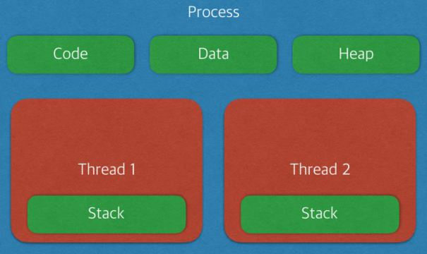

## 프로세스와 스레드(Process and Thread)

우선 선수 지식으로 프로그램의 개념을 알아보자.

**프로그램(Program)**
```
어떤 작업을 위해 실행할 수 있는 파일
컴퓨터를 사용하면서 웹 브라우저를 사용하기 위해 더블클릭하는 상황을 상상하면 좋을듯하다.
```

### 프로세스(Process)
- 실행한 프로그램이 인스턴스화 되어 메모리에 올라와 있는 상태
- 각각 별도의 주소공간을 할당한다 (독립적인 개체)
- 기본적으로 프로세스마다 최소 한개의 스레드를 소유한다. (메인 스레드 포함)
- 하나의 프로세스가 생성될 때, 기본적으로 하나의 스레드가 같이 생성된다.



`조금 더 구체적인 이미지`  


#### ↳프로세스 메모리 구조
- **Code**: 개발자가 작성한 코드를 가지고 있는 메모리 영역
- **Data**: 전역변수, 정적변수, 배열 등 초기화 된 데이터가 저장된다.
- **BSS**: 전역변수, 정적변수, 배열 등 초기화 되지 않은 데이터가 저장된다.
- **Heap**: 동적 할당시 사용 (new(), malloc() 등)
- **Stack**: 지역변수, 매개변수, 리턴 값 (임시 메모리 영역)  
`스레드는 Stack만 따로 할당 받고 나머지 영역은 서로 공유한다.`

**스레드가 Stack 영역을 따로 할당 받는 이유**
```
- 스레드는 독립적인 동작을 수행하기 위해 존재한다.
- 즉, 독립적으로 함수를 호출할 수 있어야 한다.
- 따라서 함수의 매개변수, 지역변수등을 저장하는 Stack 메모리 영역은 독립적으로 할당 받아야 한다. 
```

### 스레드(Thread)
- 어떤 프로세스 내에서 실행되는 흐름의 단위
- 프로세스가 할당받은 자원을 사용하는 실행의 단위
- **Stack**만 따로 할당받고 나머지 영역은 공유한다. 반면에 프로세스는 다은 프로세스의 메모리에 직접 접근할 수 없다.
- 한 스레드가 프로세스 자원을 변경하면, 다른 이웃 스레드(Sibling Thread)도 그 변경 결과를 즉시 볼 수 있다.

---

### Reference

[# [OS] 프로세스와 스레드의 차이](https://gmlwjd9405.github.io/2018/09/14/process-vs-thread.html)  
[프로세스와 스레드](https://github.com/devSquad-study/2023-CS-Study/blob/main/OS/os_process_thread.md)  
[프로세스 vs 스레드](https://github.com/gyoogle/tech-interview-for-developer/blob/master/Computer%20Science/Operating%20System/Process%20vs%20Thread.md)